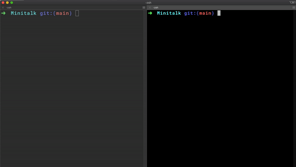
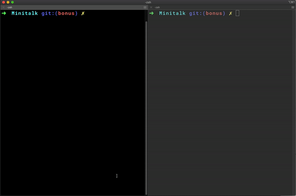

# Minitalk

*A small data exchange using UNIX signals*

## Normal version

* Minitalk is a set of two programs, a **client** and a **server**

### Description

1. Client

* The client program takes two arguments:
  * The server [PID (Process ID)](https://en.wikipedia.org/wiki/Process_identifier)
  * The message to send to the server

2. Server

* The server program takes no arguments

### Note

* This version (Normal version) does not handle `Ctrl + C` when sending unicode characters

### Usage

```sh
git clone --recurse-submodule https://github.com/Archer-01/Minitalk.git
cd Minitalk
make
```
### Demo


## Bonus version

### Description

* Behaves just like the normal version but also handles `Ctrl + C` when sending unicode characters

### Usage

```sh
git clone --recurse-submodule https://github.com/Archer-01/Minitalk.git
cd Minitalk
git checkout bonus
make
```

### Demo


[](https://forthebadge.com)
